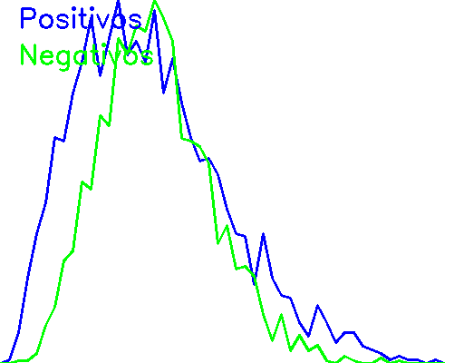
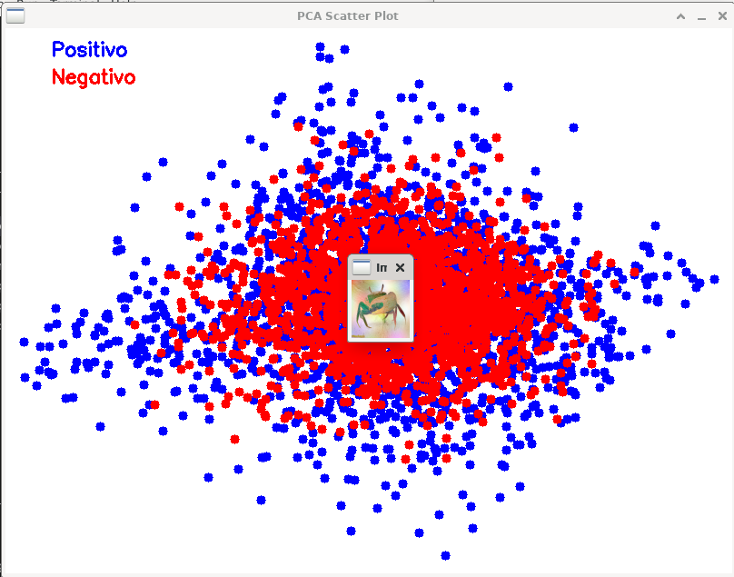

# Forward-Forward en C++

#### El markdown no muestra correctamente las fórmulas en Github, yo uso el Markdown Editor de zaaack en VSCodium.



Este documento explica la implementación del **Algoritmo Forward-Forward** introducido por Geoffrey Hinton aquí presente. El objetivo es ofrecer una comprensión matemática y conceptual completa de cada componente del código, facilitando así su estudio y aplicación.

## Árbol de carpetas y archivos sin los datos

```
F-F_Cpp/ffolder$ tree -I '*.png'
.
├── ffolder
│   ├── data
│   │   ├── negative_images
│   │   └── positive_images
│   ├── gifs
│   │   ├── 3neur2reset.gif
│   │   ├── 3neurnoresetdyn.gif
│   │   ├── 3neurnoreset.gif
│   │   ├── 512.gif
│   │   ├── outputsingleneur2reset.gif
│   │   ├── outputsingleneuronnoreset.gif
│   │   └── singlenoresetdyn.gif
│   ├── histograms
│   │   └── hacer gif con los png de la carpeta.txt
│   ├── Imagenet64_train_part1
│   │   ├── extraer datos.py
│   │   ├── output_images
│   │   └── train_data_batch_1
│   ├── include
│   │   ├── FastNoiseLite.h
│   │   ├── image_utils.hpp
│   │   ├── neural_network.hpp
│   │   ├── optimizer.hpp
│   │   └── scatter_plot_data.hpp
│   ├── Makefile
│   ├── noise
│   ├── ntop_cache
│   ├── src
│   │   ├── image_utils.cpp
│   │   ├── main_noise.cpp
│   │   ├── main_train.cpp
│   │   ├── neural_network.cpp
│   │   └── optimizer.cpp
│   └── train
├── figs
│   └── histograma.gif
└── README.md

12 directories, 25 files
```

1. `gifs` contiene algunos resultados para redes pequeñas.
2. `histograms` contiene las dos distribuciones de bondades para los conjuntos de datos, por época.
3. `Imagenet64_train_part1` contiene un segmento de los conjuntos de datos para imagenet de 64 píxeles.
4. `negative_images` contiene los PNGs de 64x64 píxeles a color del conjunto de datos sintetizado.
5. `positive_images` contiene los PNGs de 64x64 píxeles a color del conjunto de datos a estudiar.
5. `ntop_cache` contiene los BINs que representan los mejores modelos del proceso de inicializacion, contiene el ensamble.
## Tabla de Contenidos

1. [Algoritmo Forward-Forward](#algoritmo-forward-forward)
   - [Makefile](#makefile)
   - [Archivos Principales](#archivos-principales)
2. [Implementación](#implementación)
   - [Clase `Dataset`](#clase-dataset)
   - [Clase `Optimizer` y `AdamOptimizer`](#clase-optimizer-y-adamoptimizer)
   - [Clase `FullyConnectedLayer`](#clase-fullyconnectedlayer)
   - [Funciones Auxiliares](#funciones-auxiliares)
     - [División del Conjunto de Datos (`splitDataset`)](#división-del-conjunto-de-datos-splitdataset)
     - [Selección del Optimizador (`selectOptimizer`)](#selección-del-optimizador-selectoptimizer)
   - [Funciones de Visualización](#funciones-de-visualización)
     - [Visualización PCA (`visualizePCA`)](#visualización-pca-visualizepca)
     - [Histograma Combinado de Bondades (`plotGoodnessHistogramsCombined`)](#histograma-combinado-de-bondades-plotgoodnesshistogramscombined)
   - [Funciones de Entrenamiento y Evaluación (`trainAndEvaluate`)](#funciones-de-entrenamiento-y-evaluación-trainandevaluate)
   - [Función Principal (`trainModel`)](#función-principal-trainmodel)
3. [Referencias](#referencias)
4. [TODO](#todo)

---

## Algoritmo Forward-Forward

El **Algoritmo Forward-Forward** es una alternativa al método de **propagación hacia atrás** tradicionalmente utilizado para entrenar redes neuronales profundas. Introducido por Geoffrey Hinton, este algoritmo reemplaza las pasadas hacia adelante y hacia atrás de backpropagation por dos pasadas hacia adelante: una con datos positivos (reales) y otra con datos negativos (generados por la red misma o suministrados externamente).

Cada capa de la red tiene su propia función objetivo que simplemente busca maximizar una medida de "bondad" para los datos positivos y minimizarla para los datos negativos. Esta aproximación tiene el potencial de ser más biológicamente plausible y de funcionar de manera eficiente en hardware analógico de bajo consumo. Además de crear una asimetría entre la magnitud de las salidas para un conjunto vs otro, útil para aplicar otras técnicas de análisis de datos.

Por ahora todo lo estamos haciendo con una sola capa, pero implementar una red no es mucho más complicado que hacer el controlador que se dedica a decidir cuando las capas aprenden y cuando solo infieren (recuerde que la función para el forward es la que acciona que los pesos se actualizan si `learn = True`), he experimentado con poner todas las capas a aprender a la vez, pero resulta muy inestable. Además es necesario normalizar los vectores escondidos entre las capas, para que estas no aprendan a distinguir los dos conjuntos de datos a partir de las magnitudes, forzándolas a aprender a distinguir los conjuntos a partir de las relaciones entre las activaciones. Finalmente para clasificar Hinton recomienda añadir una capa lineal, o concatenar las activaciones de varias capas y usar esto como la entrada para una capa lineal. Sorprendentemente usar PCA con una sola capa representa los dos conjuntos de datos de forma desconectada si el problema es suficientemente fácil (o si concatenamos los labels con los datos de entrada, efectivamente realizando aprendizaje supervisado).

### Makefile

El `Makefile` facilita la compilación de los diferentes ejecutables (3):

```makefile
# Makefile

CXX = g++

# Detectar automáticamente si se necesita -lstdc++fs basado en la versión de GCC
GCC_VERSION := $(shell $(CXX) -dumpversion | cut -d. -f1)
ifeq ($(shell [ $(GCC_VERSION) -ge 9 ] && echo yes),yes)
    STD = -std=c++17
    FS_LIB =
else
    STD = -std=c++17
    FS_LIB = -lstdc++fs
endif

CXXFLAGS = $(STD) -Ofast -march=native -flto -fopenmp -ffast-math -funroll-loops -fno-math-errno `pkg-config --cflags opencv4` $(INCLUDE_DIR)
LDFLAGS = -flto -fopenmp `pkg-config --libs opencv4` $(FS_LIB)

# Directorio de headers
INCLUDE_DIR = -I include -I /usr/include/eigen3

# Ejecutables
TARGETS = noise train

all: $(TARGETS)

# Regla para compilar 'noise'
noise: src/image_utils.cpp src/main_noise.cpp
	$(CXX) $(CXXFLAGS) -o noise src/image_utils.cpp src/main_noise.cpp $(LDFLAGS)

# Regla para compilar 'train'
train: src/neural_network.cpp src/optimizer.cpp src/main_train.cpp
	$(CXX) $(CXXFLAGS) -o train src/neural_network.cpp src/optimizer.cpp src/main_train.cpp $(LDFLAGS)

clean:
	rm -f $(TARGETS)

.PHONY: all clean
```
Si ya tenemos los datos en las carpetas positivas y negativas podemos proceder directamente a ejecutar `./train` para entrenar el modelo deseado, de otra forma podemos usar `./noise positive` o `./noise negative` para generar los datos positivos o negativos. Podemos llamar a `./noise` con más argumentos para introducir cezgos que faciliten la distinción de la salida del modelo entre los dos conjuntos, consultar `image_utils.cpp` para más información.

#### Explicación de Componentes Clave:

- **Variables de Compilación:**
  - `CXX`: Define el compilador a utilizar (`g++`).
  - `GCC_VERSION`: Obtiene la versión de GCC instalada para determinar si se requiere la biblioteca `-lstdc++fs`.
  - `STD`: Establece el estándar de C++ (`-std=c++17`).
  - `FS_LIB`: Biblioteca del sistema de archivos, necesaria para versiones de GCC menores a 9.
  - `CXXFLAGS`: Flags de compilación optimizadas para rendimiento, incluyendo optimizaciones de velocidad y soporte para OpenMP y OpenCV.
  - `LDFLAGS`: Flags de enlace, incluyendo optimizaciones y bibliotecas necesarias.

- **Reglas de Compilación:**
  - `all`: Compila todos los ejecutables definidos en `TARGETS`.
  - `train`, `noise`: Las dos reglas sirven para construir los datos y entrenar la red.

- **Regla de Limpieza:**
  - `clean`: Elimina los ejecutables compilados.

### Archivos Principales

El proyecto contiene principalmente dos ejecutables:

1. **`train` (`main_train.cpp`):** Construye el ejecutable para entrenar, evaluar y visualizar una red.
2. **`noise` (`main_noise.cpp`):** Usa Gaussian Splatting para producir un conjunto de datos complejo de juguete de imágenes de 64x64 píxeles de un color aleatorio con manchones de colores, también produce el conjunto negativo a partir del positivo, mezclando dos datos por canal con tres máscaras aleatorias. Produce ambos por defecto pero puede producir uno u otro con el argumento `positive` o `negative`.

## Implementación

### Clase `Dataset`

#### Carga y Preprocesamiento de Imágenes

La clase `Dataset` se encarga de cargar imágenes desde un directorio, normalizarlas y convertirlas en vectores de características para su posterior uso en el entrenamiento de la red neuronal.

1. **Normalización de Píxeles:**

   ```cpp
   img.convertTo(img, CV_32F, 1.0 / 255.0); // Normaliza los píxeles
   ```

   - **Es decir:** Cada píxel de la imagen, originalmente representado por un valor entero en el rango [0, 255], se escala al rango [0, 1] dividiendo por 255.

     $$
     \text{normalizado} = \frac{\text{original}}{255.0}
     $$

2. **Aplanamiento de la Imagen:**

   ```cpp
   Eigen::VectorXf sample(img.rows * img.cols * img.channels());
   int idx = 0;
   for (int i = 0; i < img.rows; ++i) {
       for (int j = 0; j < img.cols; ++j) {
           cv::Vec3f pixel = img.at<cv::Vec3f>(i, j);
           for (int c = 0; c < img.channels(); ++c) {
               sample(idx++) = pixel[c];
           }
       }
   }
   ```

   - **Es decir:** La imagen 2D con múltiples canales (por ejemplo, RGB) se convierte en un vector de una sola dimensión concatenando los valores de los píxeles. Con datos de 64x64 pixeles a color y con solo tres neuronas por capa tenemos ya `64*64*3*3 + 3= 36867` parámetros.

3. **Validación de Tamaños Consistentes:**

   ```cpp
   if (img.rows != image_height || img.cols != image_width) {
       throw std::runtime_error("Las imágenes deben tener el mismo tamaño.");
   }
   ```

   - **Es decir:** Todas las muestras deben tener el mismo tamaño $ d = \text{rows} \times \text{cols} \times \text{channels} $ para que la red neuronal pueda procesarlas de manera consistente.

### Clase `Optimizer` y `AdamOptimizer`

#### Optimización de Parámetros

El optimizador es responsable de actualizar los pesos y sesgos de las capas de la red neuronal en función de los gradientes calculados durante el entrenamiento.

1. **Algoritmo Adam:**

   ```cpp
   m_weights = beta1 * m_weights + (1.0f - beta1) * gradients;
   v_weights = beta2 * v_weights + (1.0f - beta2) * gradients.array().square().matrix();
   Eigen::MatrixXf m_hat = m_weights.array() / (1.0f - std::pow(beta1, t_weights));
   Eigen::MatrixXf v_hat = v_weights.array() / (1.0f - std::pow(beta2, t_weights));

   weights.array() -= lr * m_hat.array() / (v_hat.array().sqrt() + eps);
   ```

   - **Es decir:**

     El optimizador Adam actualiza los parámetros $ \theta $ (pesos o sesgos) utilizando las siguientes ecuaciones:

     $$
     m_t = \beta_1 m_{t-1} + (1 - \beta_1) g_t
     $$
     $$
     v_t = \beta_2 v_{t-1} + (1 - \beta_2) g_t^2
     $$
     $$
     \hat{m}_t = \frac{m_t}{1 - \beta_1^t}
     $$
     $$
     \hat{v}_t = \frac{v_t}{1 - \beta_2^t}
     $$
     $$
     \theta = \theta - \alpha \frac{\hat{m}_t}{\sqrt{\hat{v}_t} + \epsilon}
     $$

     Donde:
     - $ g_t $ es el gradiente en el tiempo $ t $.
     - $ \beta_1 $ y $ \beta_2 $ son los coeficientes de decaimiento para los momentos.
     - $ \alpha $ es la tasa de aprendizaje.
     - $ \epsilon $ es un término de estabilidad para evitar divisiones por cero.
     - $ \hat{m}_t $ y $ \hat{v}_t $ son las estimaciones corregidas de sesgo para el primer y segundo momento, respectivamente.

2. **Actualización de Pesos y Sesgos:**

   El optimizador utiliza las estimaciones $ \hat{m}_t $ y $ \hat{v}_t $ para actualizar los pesos y sesgos mediante el optimizador seleccionado (por ejemplo, Adam).

   ```cpp
   optimizer->updateWeights(weights, grad_weights);
   optimizer->updateBiases(biases, grad_biases);
   ```

   - **Es decir:** La actualización sigue las reglas definidas por el optimizador Adam, como se explicó anteriormente.

### Clase `FullyConnectedLayer`

#### Inicialización de Pesos y Sesgos

1. **Inicialización de He:**

   ```cpp
   float std_dev = std::sqrt(2.0f / input_size); // Inicialización He
   std::normal_distribution<float> weight_dist(0.0f, std_dev);
   weights = Eigen::MatrixXf::NullaryExpr(output_size, input_size, [&]() { return weight_dist(gen); });
   biases = Eigen::VectorXf::Constant(output_size, 0.01f); // Inicializa sesgos pequeños
   ```

   - **Es decir:** Los pesos se inicializan con una distribución normal centrada en 0 con una desviación estándar de $ \sqrt{\frac{2}{n_{\text{entrada}}}} $, donde $ n_{\text{entrada}} $ es el número de entradas a la capa. Esta inicialización, conocida como **Inicialización de He**, ayuda a mantener la varianza de las activaciones a través de las capas, facilitando el entrenamiento de redes profundas. No se ha experimentado si debemos buscar distribuciones probabilísticas específicas para la inicialización de redes F-F, pues aprenden capa a capa, pero se eligió He por la función de activación leaky ReLu que se usó.

     $$
     W_{ij} \sim \mathcal{N}\left(0, \sqrt{\frac{2}{n_{\text{entrada}}}}\right)
     $$
     $$
     b_i = 0.01
     $$

#### Pasada Hacia Adelante (`forward`)

1. **Cálculo de Pre-Activaciones:**

   ```cpp
   pre_activations.noalias() = weights * inputs + biases;
   ```

   - **Es decir:**

     $$
     \mathbf{z} = \mathbf{W} \cdot \mathbf{x} + \mathbf{b}
     $$

     Donde:
     - $ \mathbf{W} $ es la matriz de pesos.
     - $ \mathbf{x} $ es el vector de entrada.
     - $ \mathbf{b} $ es el vector de sesgos.
     - $ \mathbf{z} $ son las pre-activaciones.

2. **Aplicación de la Función de Activación:**

   ```cpp
   outputs = pre_activations.unaryExpr(activation);
   ```

   - **Es decir:**

     $$
     \mathbf{a} = \sigma(\mathbf{z})
     $$

     Donde $ \sigma $ es la función de activación (en nuestro caso, Leaky ReLU):

     $$
     \sigma(z_i) = \begin{cases}
     z_i & \text{si } z_i > 0 \\
     0.01 z_i & \text{si } z_i \leq 0
     \end{cases}
     $$

3. **Cálculo de la Bondad:**

   ```cpp
   float goodness = outputs.squaredNorm();
   ```

   - **Es decir:**

     La **bondad** se define como la norma euclidiana al cuadrado de las activaciones de salida:

     $$
     \text{bondad} = \| \mathbf{a} \|^2 = \sum_{i=1}^{m} a_i^2
     $$

     Donde $ m $ es el número de neuronas en la capa. Elegido por Geofree Hinton gracias a que tiene una derivada simple, multiplicar por dos en algunos contextos hasta es un simple bit shift.
   

#### Cálculo de la Pérdida y Gradientes

1. **Pérdida Basada en la Bondad:**

   ```cpp
   float p = 1.0f / (1.0f + std::exp(-(goodness - threshold)));
   float y = is_positive ? 1.0f : 0.0f;
   float dL_dG = p - y;
   ```

   - **Es decir:**

     Se utiliza una función sigmoide para mapear la bondad a una probabilidad $ p $:

     $$
     p = \sigma(\text{bondad} - \theta) = \frac{1}{1 + e^{-(G - \theta)}}
     $$

     Donde $ \theta $ es el umbral.

     La pérdida se define como la diferencia entre la probabilidad predicha y la etiqueta objetivo $ y $:

     $$
     \frac{\partial L}{\partial G} = p - y
     $$

     Donde:
     - $ y = 1 $ si la muestra es positiva.
     - $ y = 0 $ si la muestra es negativa.

2. **Cálculo de Gradientes:**

   ```cpp
   Eigen::VectorXf dG_da = 2.0f * outputs;
   Eigen::VectorXf dL_da = dL_dG * dG_da;
   Eigen::VectorXf dL_dz = dL_da.array() * pre_activations.unaryExpr(activation_derivative).array();
   Eigen::MatrixXf grad_weights = dL_dz * inputs.transpose();
   Eigen::VectorXf grad_biases = dL_dz;
   ```

   - **Es decir:**

     - **Derivada de la Bondad respecto a las Activaciones:**

       $$
       \frac{\partial G}{\partial \mathbf{a}} = 2 \mathbf{a}
       $$

     - **Derivada de la Pérdida respecto a las Activaciones:**

       $$
       \frac{\partial L}{\partial \mathbf{a}} = \frac{\partial L}{\partial G} \cdot \frac{\partial G}{\partial \mathbf{a}} = (p - y) \cdot 2 \mathbf{a}
       $$

     - **Derivada de la Pérdida respecto a las Pre-Activaciones:**

       Aplicando la regla de la cadena con la función de activación:

       $$
       \frac{\partial L}{\partial \mathbf{z}} = \frac{\partial L}{\partial \mathbf{a}} \cdot \frac{\partial \mathbf{a}}{\partial \mathbf{z}} = \frac{\partial L}{\partial \mathbf{a}} \cdot \sigma'(\mathbf{z})
       $$

       Donde $ \sigma'(\mathbf{z}) $ es la derivada de la función de activación.

     - **Gradientes para Pesos y Sesgos:**

       $$
       \frac{\partial L}{\partial \mathbf{W}} = \frac{\partial L}{\partial \mathbf{z}} \cdot \mathbf{x}^T
       $$
       $$
       \frac{\partial L}{\partial \mathbf{b}} = \frac{\partial L}{\partial \mathbf{z}}
       $$

3. **Actualización de Pesos y Sesgos:**

   Los gradientes calculados se utilizan para actualizar los pesos y sesgos mediante el optimizador seleccionado (por ejemplo, Adam).

   ```cpp
   optimizer->updateWeights(weights, grad_weights);
   optimizer->updateBiases(biases, grad_biases);
   ```

   - **Es decir:** La actualización sigue las reglas definidas por el optimizador Adam, como se explicó anteriormente.

### Funciones Auxiliares

#### División del Conjunto de Datos (`splitDataset`)

Esta función divide el conjunto de datos completo en subconjuntos de entrenamiento y validación basándose en una fracción dada.

- **Es decir:**

  Dado un conjunto de datos $ D $, se divide en $ D_{\text{entrenamiento}} $ y $ D_{\text{validación}} $ tal que:

  $$
  D_{\text{entrenamiento}} = \{ x_i \}_{i=1}^{\lfloor |D| \cdot f \rfloor}
  $$
  $$
  D_{\text{validación}} = \{ x_i \}_{i=\lfloor |D| \cdot f \rfloor + 1}^{|D|}
  $$

  Donde $ f $ es la fracción de datos destinados al entrenamiento (por ejemplo, 0.8 para 80%).

#### Selección del Optimizador (`selectOptimizer`)

Permite al usuario seleccionar el optimizador a utilizar durante el entrenamiento. Actualmente, ofrece la opción de `AdamOptimizer`.

- **Es decir:** No involucra directamente operaciones matemáticas, pero la elección del optimizador afecta cómo se actualizan los parámetros $ \theta $ durante el entrenamiento.

### Funciones de Visualización



#### Visualización PCA (`visualizePCA`)

Realiza un Análisis de Componentes Principales (PCA) sobre las activaciones de una capa de la red para reducir la dimensionalidad y visualizar los datos en 2D o 3D.

1. **Análisis de Componentes Principales:**

   ```cpp
   cv::PCA pca(data, cv::Mat(), cv::PCA::DATA_AS_ROW, num_components);
   cv::Mat projected_data = pca.project(data);
   ```

   - **Es decir:**

     PCA busca encontrar una base ortonormal de $ k $ dimensiones que captura la mayor varianza posible de los datos.

     $$
     \mathbf{Y} = \mathbf{X} \mathbf{W}
     $$

     Donde:
     - $ \mathbf{X} $ es la matriz de datos original.
     - $ \mathbf{W} $ es la matriz de pesos de PCA.
     - $ \mathbf{Y} $ es la matriz de datos proyectados en el espacio PCA.

2. **Mapeo de Coordenadas PCA a Píxeles:**

   Las coordenadas resultantes de PCA se escalan para ajustarse a la imagen de salida para el scatter plot.

   ```cpp
   auto mapToPixel = [&](float val, float min_val, float max_val) {
       return static_cast<int>((val - min_val) / (max_val - min_val) *
                               (img_size - 40) + 20);
   };
   ```

   - **Es decir:** Normaliza las coordenadas PCA al rango [20, img_size - 20] para visualización.

     $$
     \text{pixel\_coord} = \left( \frac{\text{val} - \text{min\_val}}{\text{max\_val} - \text{min\_val}} \right) \times (\text{img\_size} - 40) + 20
     $$

3. **Interacción con el Scatter Plot:**

   Permite al usuario hacer clic en puntos específicos del scatter plot para visualizar la imagen correspondiente.

### Funciones de Entrenamiento y Evaluación (`trainAndEvaluate`)

Esta función maneja el ciclo de entrenamiento del modelo, incluyendo la pasada hacia adelante, actualización de pesos, evaluación en el conjunto de validación y ajuste dinámico del umbral si está habilitado. Por ahora es código muerto comentado en `main_train.cpp` y sirve para crear el método que controla el aprendizaje de varias capas intercaladas con la normalización de los vectores escondidos.

**Parámetros de la Función:**

- `Dataset& train_positive_samples`: Conjunto de datos de entrenamiento de muestras positivas.
- `Dataset& train_negative_samples`: Conjunto de datos de entrenamiento de muestras negativas.
- `Dataset& val_positive_samples`: Conjunto de datos de validación de muestras positivas.
- `Dataset& val_negative_samples`: Conjunto de datos de validación de muestras negativas.
- `FullyConnectedLayer& layer`: La capa de red neuronal que se está entrenando.
- `float& threshold`: El umbral para determinar la bondad.
- `size_t epochs`: Número de épocas de entrenamiento.
- `const std::function<float(float)>& activation`: Función de activación.
- `const std::function<float(float)>& activation_derivative`: Derivada de la función de activación.
- `bool verbose`: Si se debe imprimir información detallada durante el entrenamiento.
- `double& best_score`: La mejor precisión obtenida hasta ahora.
- `bool dynamic_threshold`: Si se debe ajustar el umbral dinámicamente.
- `std::vector<float>& goodness_positive_vals`: Vector para almacenar las bondades de las muestras positivas.
- `std::vector<float>& goodness_negative_vals`: Vector para almacenar las bondades de las muestras negativas.
- `size_t patience`: Número de épocas para esperar antes de revertir al mejor modelo si no hay mejora.
- `FullyConnectedLayer& best_layer`: Capa para almacenar el mejor modelo encontrado hasta ahora.
- `float& best_threshold`: Mejor umbral encontrado hasta ahora.

**Descripción Detallada:**

1. **Inicialización:**

   Se inicializan variables para rastrear el número de muestras y controlar el criterio de parada temprana (early stopping) basado en paciencia.

   ```cpp
   size_t train_positive_size = train_positive_samples.getNumSamples();
   size_t train_negative_size = train_negative_samples.getNumSamples();
   size_t val_positive_size = val_positive_samples.getNumSamples();
   size_t val_negative_size = val_negative_samples.getNumSamples();
   size_t epochs_without_improvement = 0; // Contador de épocas sin mejora
   ```

2. **Ciclo de Entrenamiento por Época:**

   Para cada época:

   - **Mezcla y Barajado de Muestras Positivas y Negativas:**

     Se crea una lista combinada de todas las muestras de entrenamiento con sus etiquetas y se baraja aleatoriamente.

     ```cpp
     // Crear una lista combinada de todas las muestras con sus etiquetas
     std::vector<std::pair<std::reference_wrapper<const Eigen::VectorXf>, bool>> combined_train_samples;
     combined_train_samples.reserve(train_positive_size + train_negative_size);

     for (size_t i = 0; i < train_positive_size; ++i) {
         combined_train_samples.emplace_back(train_positive_samples.getSample(i), true); // Positivo
     }
     for (size_t i = 0; i < train_negative_size; ++i) {
         combined_train_samples.emplace_back(train_negative_samples.getSample(i), false); // Negativo
     }

     // Barajar la lista combinada
     std::random_device rd;
     std::mt19937 g(rd());
     std::shuffle(combined_train_samples.begin(), combined_train_samples.end(), g);
     ```

     - **Es decir:** Se mezclan las muestras positivas y negativas en un solo conjunto y se barajan aleatoriamente para asegurar que el modelo vea una variedad de ejemplos durante el entrenamiento, mejorando así su capacidad de generalización.

   - **Entrenamiento en la Lista Combinada Barajada:**

     Se realiza el entrenamiento iterando sobre la lista combinada de muestras, aplicando el método `forward` de la capa con el flag `learn = true` para actualizar los pesos.

     ```cpp
     // Entrenamiento en la lista combinada barajada
     #pragma omp parallel for schedule(static)
     for (size_t i = 0; i < combined_train_samples.size(); ++i) {
         const Eigen::VectorXf& input = combined_train_samples[i].first.get();
         bool is_positive = combined_train_samples[i].second;
         Eigen::VectorXf output; // Variable para almacenar la salida
         layer.forward(input, output, true, is_positive, threshold, activation, activation_derivative);
     }
     ```

     - **Es decir:** Para cada muestra en el conjunto combinado, se realiza una pasada hacia adelante y se actualizan los parámetros para maximizar o minimizar la bondad según si la muestra es positiva o negativa.

   - **Evaluación en Conjunto de Validación:**

     Después de cada época, se evalúa el modelo en el conjunto de validación para medir su rendimiento y ajustar el umbral si es necesario.

     ```cpp
     // Evaluación en muestras positivas
     #pragma omp parallel for reduction(+:correct_positive)
     for (size_t i = 0; i < val_positive_size; ++i) {
         const Eigen::VectorXf& input = val_positive_samples.getSample(i);
         Eigen::VectorXf output;
         layer.forward(input, output, false, true, threshold, activation, activation_derivative);

         float goodness = output.squaredNorm();
         #pragma omp critical
         {
             goodness_positive_vals.push_back(goodness);
         }

         if (goodness > threshold) {
             ++correct_positive;
         }
     }

     // Evaluación en muestras negativas
     #pragma omp parallel for reduction(+:correct_negative)
     for (size_t i = 0; i < val_negative_size; ++i) {
         const Eigen::VectorXf& input = val_negative_samples.getSample(i);
         Eigen::VectorXf output;
         layer.forward(input, output, false, false, threshold, activation, activation_derivative);

         float goodness = output.squaredNorm();
         #pragma omp critical
         {
             goodness_negative_vals.push_back(goodness);
         }

         if (goodness < threshold) {
             ++correct_negative;
         }
     }
     ```

     - **Es decir:** Se calcula la bondad de cada muestra en el conjunto de validación y se determina si el modelo ha clasificado correctamente la muestra basándose en el umbral actual.

   - **Cálculo de la Precisión:**

     Se calcula la precisión total y por clase, y se imprime si `verbose` es verdadero.

     ```cpp
     double accuracy = (static_cast<double>(correct_positive + correct_negative) /
                       (val_positive_size + val_negative_size)) * 100.0;

     double accuracyn = (static_cast<double>(correct_negative) /
                       (val_negative_size)) * 100.0;

     double accuracyp = (static_cast<double>(correct_positive) /
                       (val_positive_size)) * 100.0;

     if (verbose) {
         std::cout << "Precisión en validación: " << accuracy << "%\n"
                   << "En los positivos: " << accuracyp << "%\n"
                   << "En los negativos: " << accuracyn << "%\n";
     }
     ```

   - **Actualización del Mejor Modelo y Control de Paciencia:**

     Se verifica si la precisión actual es la mejor hasta el momento. Si es así, se actualiza el mejor modelo y se reinicia el contador de paciencia. Si no hay mejora después de cierto número de épocas (`patience`), se revierte al mejor modelo encontrado hasta ahora.

     ```cpp
     if (accuracy > best_score) {
         best_score = accuracy;
         epochs_without_improvement = 0;

         // Guarda el mejor modelo
         best_layer = layer; // Asumiendo que la clase FullyConnectedLayer tiene un operador de asignación
         best_threshold = threshold;
     } else {
         epochs_without_improvement++;
     }

     // Revertir al mejor modelo si no hay mejora en 'patience' épocas
     if (epochs_without_improvement >= patience) {
         if (verbose) {
             std::cout << "No hay mejora en las últimas " << patience << " épocas. Revirtiendo al mejor modelo.\n";
         }
         layer = best_layer;
         threshold = best_threshold;
         epochs_without_improvement = 0; // Reinicia el contador
     }
     ```

     - **Es decir:** Se implementa un mecanismo de parada temprana para prevenir sobreajuste y mejorar la capacidad de generalización del modelo.

   - **Ajuste Dinámico del Umbral (si está habilitado):**

     Si `dynamic_threshold` es verdadero, se ajusta el umbral basándose en las bondades promedio de las muestras positivas y negativas.

     ```cpp
     // Ajusta dinámicamente el umbral si está habilitado
     if (dynamic_threshold) {
         float avg_goodness_positive = std::accumulate(goodness_positive_vals.begin(),
                                                       goodness_positive_vals.end(), 0.0f) / val_positive_size;
         float avg_goodness_negative = std::accumulate(goodness_negative_vals.begin(),
                                                       goodness_negative_vals.end(), 0.0f) / val_negative_size;

         threshold = (avg_goodness_positive + avg_goodness_negative) / 2.0f;
         if (verbose) {
             std::cout << "Umbral ajustado a: " << threshold << "\n";
         }
     }
     ```

     - **Es decir:** El umbral se actualiza para ser el promedio de las bondades promedio de ambas clases, ayudando a mantener una separación óptima entre las clases.

   - **Guardado de Histogramas Combinados:**

     Se generan y guardan los histogramas combinados de las bondades para cada época, lo cual es útil para visualizar el progreso del entrenamiento.

     ```cpp
     // Guardar los histogramas combinados de esta época con el nombre único
     std::string hist_filename;
     if (epoch < 9) {
         hist_filename = "histograms/Histograma_Combined_epoch_0" + std::to_string(epoch + 1) + ".png";
     } else {
         hist_filename = "histograms/Histograma_Combined_epoch_" + std::to_string(epoch + 1) + ".png";
     }

     plotGoodnessHistogramsCombined(goodness_positive_vals,
                                    goodness_negative_vals,
                                    threshold,
                                    hist_filename); // Pasar 'hist_filename' como ruta de guardado

     if (verbose) {
         std::cout << "Histograma combinado guardado en: " << hist_filename << "\n";
     }
     ```

     - **Es decir:** Se visualiza la distribución de bondades de las muestras positivas y negativas para monitorear cómo el modelo está separando ambas clases a lo largo del tiempo.

---

### Función Principal (`trainModel`)

Esta función orquesta todo el flujo de entrenamiento, desde la carga de datos hasta la visualización de resultados. En esta versión, se han incorporado nuevas estrategias de entrenamiento, incluyendo múltiples inicializaciones, selección de los mejores modelos (`ntop`), ensamblado de modelos y entrenamiento prolongado del mejor modelo. Actualmente sirve de piscina para ir desarrollando las capacidades del código.

**Descripción Detallada:**

1. **Carga de Conjuntos de Datos:**

   ```cpp
   Dataset positive_samples("data/positive_images/"); // Directorio de imágenes positivas
   Dataset negative_samples("data/negative_images/"); // Directorio de imágenes negativas
   ```

   - **Es decir:** Se cargan y preprocesan las imágenes positivas y negativas para crear conjuntos de datos adecuados para el entrenamiento y la validación.

2. **División en Entrenamiento y Validación:**

   ```cpp
   // Divide los conjuntos de datos en entrenamiento (80%) y validación (20%)
   splitDataset(positive_samples, 0.8f, train_positive_samples,
                val_positive_samples);
   splitDataset(negative_samples, 0.8f, train_negative_samples,
                val_negative_samples);
   ```

   - **Es decir:** Se divide cada conjunto (positivo y negativo) en un 80% para entrenamiento y un 20% para validación, asegurando que ambas clases estén representadas adecuadamente en ambos subconjuntos.

3. **Selección del Optimizador y Configuración Inicial:**

   ```cpp
   // Selecciona el optimizador
   std::shared_ptr<Optimizer> optimizer = selectOptimizer();

   // Pregunta al usuario si desea utilizar un umbral dinámico
   bool dynamic_threshold = false;
   std::cout << "¿Desea utilizar un umbral dinámico? (1 = Sí, 0 = No): ";
   int threshold_choice;
   std::cin >> threshold_choice;
   dynamic_threshold = (threshold_choice == 1);

   // Solicita al usuario el umbral inicial
   float threshold;
   std::cout << "Ingrese el umbral inicial para determinar la bondad: ";
   std::cin >> threshold;
   ```

   - **Es decir:** Se configura el optimizador y se establece el umbral inicial, que es crucial para la clasificación de muestras positivas y negativas.

4. **Configuración del Entrenamiento con Múltiples Inicializaciones:**

   Se solicita al usuario información sobre el número de inicializaciones, épocas por inicialización y el número de mejores modelos a recordar (`ntop`).

   ```cpp
   // Solicita al usuario el número total de épocas de entrenamiento largo
   size_t total_epochs_long;
   std::cout << "Ingrese el número total de épocas de entrenamiento largo: ";
   std::cin >> total_epochs_long;

   // Solicita al usuario el tamaño de la capa completamente conectada
   size_t input_size = train_positive_samples.getInputSize();
   size_t output_size;
   std::cout << "Ingrese el tamaño de la capa (número de neuronas): ";
   std::cin >> output_size;

   // Solicita al usuario la cantidad de inicializaciones y épocas por inicialización
   size_t num_initializations;
   size_t initial_epochs;
   std::cout << "Ingrese el número de inicializaciones iniciales: ";
   std::cin >> num_initializations;
   std::cout << "Ingrese el número de épocas por inicialización (1 a 4): ";
   std::cin >> initial_epochs;

   // Solicita al usuario el número de mejores modelos a recordar (ntop)
   size_t ntop;
   std::cout << "Ingrese el número de mejores modelos a recordar (ntop): ";
   std::cin >> ntop;

   // Configuración de la paciencia (tolerancia)
   size_t patience;
   std::cout << "Ingrese el número de épocas de tolerancia sin mejora (patience): ";
   std::cin >> patience;
   ```

   - **Es decir:** Se prepara para realizar múltiples inicializaciones del modelo, entrenando cada uno por un número pequeño de épocas y planeando seleccionar los mejores modelos para formar un ensemble.

5. **Entrenamiento con Múltiples Inicializaciones:**

   Se entrena varios modelos con diferentes inicializaciones y se guardan los mejores basados en su rendimiento en el conjunto de validación.

   ```cpp
   // Lista para almacenar los mejores ntop modelos y sus puntuaciones
   std::vector<std::pair<double, std::string>> top_models; // <score, filepath>

   // Realizar múltiples inicializaciones
   for (size_t init = 0; init < num_initializations; ++init) {
       // Crear una nueva capa con pesos inicializados aleatoriamente
       FullyConnectedLayer current_layer(input_size, output_size, optimizer);

       // Entrenar por el número de épocas especificado para la inicialización
       for (size_t epoch = 0; epoch < initial_epochs; ++epoch) {
           // Entrenamiento y evaluación
           // ...
       }

       // Guardar el mejor modelo de esta inicialización en la carpeta ntop_cache
       std::string model_filename = "ntop_cache/model_init_" + std::to_string(init + 1) + ".bin";
       best_init_layer.saveModel(model_filename);

       // Agregar el modelo y su puntuación a la lista de top_models
       top_models.emplace_back(best_score_init, model_filename);

       // Ordenar la lista de top_models y mantener solo los ntop mejores
       // ...
   }
   ```

   - **Es decir:** Se entrenan varios modelos inicializados aleatoriamente, se evalúan en el conjunto de validación y se guardan los mejores `ntop` modelos para su uso posterior.

6. **Evaluación y Selección del Mejor Modelo Individual:**

   ```cpp
   // Evaluación del mejor modelo individual
   FullyConnectedLayer best_individual_model(input_size, output_size, optimizer);
   best_individual_model.loadModel(top_models.front().second);

   // Evaluación en conjunto de validación
   // ...
   ```

   - **Es decir:** Se carga el modelo con la mejor precisión en validación y se evalúa su rendimiento.

7. **Creación y Evaluación del Ensemble por Votación:**

   ```cpp
   // Cargar los ntop mejores modelos para el ensemble
   std::vector<FullyConnectedLayer> ensemble_models;
   for (const auto& model_info : top_models) {
       FullyConnectedLayer model(input_size, output_size, optimizer);
       model.loadModel(model_info.second);
       ensemble_models.push_back(model);
   }

   // Evaluación del ensemble mediante votación en el conjunto de validación
   // ...
   ```

   - **Es decir:** Se crea un ensemble de los mejores modelos y se evalúa su rendimiento mediante votación mayoritaria.

8. **Creación y Evaluación del Modelo Promedio:**

   ```cpp
   // Crear el modelo promedio (promediando pesos y biases)
   FullyConnectedLayer averaged_model = ensemble_models.front(); // Inicializar con el primer modelo

   // Promediar los pesos y biases de los modelos
   Eigen::MatrixXf accumulated_weights = averaged_model.getWeights();
   Eigen::VectorXf accumulated_biases = averaged_model.getBiases();

   for (size_t i = 1; i < ensemble_models.size(); ++i) {
       accumulated_weights += ensemble_models[i].getWeights();
       accumulated_biases += ensemble_models[i].getBiases();
   }

   accumulated_weights /= ensemble_models.size();
   accumulated_biases /= ensemble_models.size();

   averaged_model.setWeights(accumulated_weights);
   averaged_model.setBiases(accumulated_biases);

   // Evaluación del modelo promedio en el conjunto de validación
   // ...
   ```

   - **Es decir:** Se crea un modelo promedio al promediar los pesos y sesgos de los `ntop` mejores modelos, y se evalúa su rendimiento.

9. **Comparación y Selección del Mejor Modelo para el Entrenamiento Largo:**

   ```cpp
   // Comparar las precisiones y decidir con cuál modelo continuar
   double max_accuracy = std::max({ accuracy_individual, accuracy_ensemble_vote, accuracy_averaged });

   FullyConnectedLayer layer(input_size, output_size, optimizer); // Modelo para el entrenamiento largo

   if (max_accuracy == accuracy_averaged) {
       layer = averaged_model;
       best_overall_threshold = threshold;
   } else if (max_accuracy == accuracy_ensemble_vote) {
       // No podemos entrenar directamente un ensemble, así que usaremos el modelo promedio
       layer = averaged_model;
       best_overall_threshold = threshold;
   } else {
       layer = best_individual_model;
       best_overall_threshold = threshold;
   }
   ```

   - **Es decir:** Se selecciona el modelo con mejor rendimiento para continuar con el entrenamiento largo. Si el ensemble por votación tiene el mejor rendimiento, se utiliza el modelo promedio para continuar entrenando.

10. **Entrenamiento Largo del Mejor Modelo Seleccionado:**

    ```cpp
    // Continuar con el entrenamiento largo utilizando el modelo seleccionado
    for (size_t epoch = 0; epoch < total_epochs_long; ++epoch) {
        // Entrenamiento y evaluación
        // ...
    }

    // Establecer la capa y umbral al mejor encontrado durante el entrenamiento largo
    FullyConnectedLayer final_layer = best_overall_layer;
    threshold = best_overall_threshold;
    ```

    - **Es decir:** Se continúa entrenando el modelo seleccionado por un número mayor de épocas, aplicando técnicas como parada temprana y ajuste dinámico del umbral.

11. **Guardado del Mejor Modelo Final y Visualización de Resultados:**

    ```cpp
    // Solicita al usuario la ruta para guardar el modelo final
    std::string model_path;
    std::cout << "\nIngrese la ruta para guardar el mejor modelo final (ej., best_model_final.bin): ";
    std::cin >> model_path;
    final_layer.saveModel(model_path);

    // Visualización de histogramas de bondad (última época)
    plotGoodnessHistogramsCombined(goodness_positive_vals,
                                   goodness_negative_vals,
                                   threshold,
                                   final_hist_filename);

    // Visualización PCA
    int num_components;
    std::cout << "\nIngrese el número de componentes PCA (2 o 3): ";
    std::cin >> num_components;
    visualizePCA(final_layer, val_positive_samples, val_negative_samples, num_components, threshold);
    ```

    - **Es decir:** Se guarda el mejor modelo final encontrado y se visualizan los resultados mediante histogramas combinados y análisis PCA.

## Referencias

1. **Eigen:** [Eigen C++ Library](https://eigen.tuxfamily.org/)  
   Biblioteca de C++ para álgebra lineal, matrices y vectores, optimizada para operaciones matemáticas de alto rendimiento.

2. **OpenCV:** [Open Source Computer Vision Library](https://opencv.org/)  
   Biblioteca de visión por computadora que facilita la manipulación, procesamiento y visualización de imágenes y videos.

3. **FastNoiseLite:** [FastNoiseLite GitHub Repository](https://github.com/Auburn/FastNoiseLite)  
   Biblioteca de generación de ruido rápida y eficiente utilizada para crear máscaras y datos sintéticos en la generación de conjuntos de datos.

4. **Forward-Forward Algorithm:**  
   Hinton, G. (2022). *The Forward-Forward Algorithm: Some Preliminary Investigations*. Disponible en [ArXiv](https://arxiv.org/abs/2212.13345)  
   Introduce el algoritmo Forward-Forward como una alternativa al backpropagation tradicional para el entrenamiento de redes neuronales, capa a capa, de forma autosupervisada.

5. **C++ Standard Library:**  
   Documentación oficial de la [Standard Template Library (STL)](https://en.cppreference.com/w/cpp) utilizada para estructuras de datos, algoritmos y utilidades fundamentales en C++.

6. **OpenMP:** [OpenMP Official Website](https://www.openmp.org/)  
   API para programación paralela en sistemas de memoria compartida, utilizada en el código para acelerar el entrenamiento y evaluación de la red neuronal.

7. **Filesystem Library:**  
   Documentación de la [Biblioteca `<filesystem>` de C++](https://en.cppreference.com/w/cpp/filesystem) utilizada para operaciones de manejo de archivos y directorios.

8. **C++ Compiler (GCC):**  
   GNU Compiler Collection, utilizado para compilar el código con optimizaciones de rendimiento y soporte para C++17.

## TODO

1. Implementar cargado de modelos para resumir el entrenamiento de un modelo memorablemente bueno con el mismo conjunto de datos, o usar otro conjunto similar.

2. Implementar el aprendizaje para el ensamble, por ahora continúa aprendiendo con el promedio de los ntop modelos.

3. Actualizar la documentación.

4. Factorizar código de los últimos métodos.